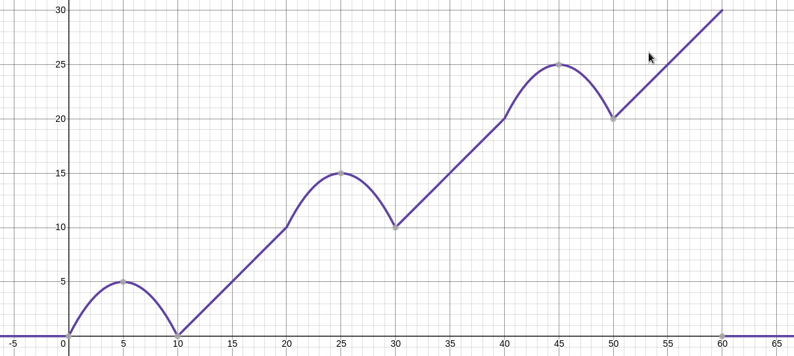

# piecewise-defined-function

This dependency-less crate can create and combine piecewise-defined functions that consist of linear and quadratic equations or print them out via many notations, e. g. Iverson brackets. 

## Example

```
let a_different_step_function = PiecewiseDefinedFunction {
	functions: vec![
		Function::new(0.0, 0.0, 10.0, 0.0, 5.0),
		Function::new(10.0, 0.0, 20.0, 10.0, 0.0),
		Function::new(20.0, 10.0, 30.0, 10.0, 5.0),
		Function::new(30.0, 10.0, 40.0, 20.0, 0.0),
		Function::new(40.0, 20.0, 50.0, 20.0, 5.0),
		Function::new(50.0, 20.0, 60.0, 30.0, 0.0),
	],
};
a_different_step_function.print(&Notation::ZeroToThePowerOfZeroIsOneDesmos);
```

Output function:

```
(-0.2*x^2+2*x+-0)*(((1+(x-0)/((x-0)^2+0^{((x-0)^2)})^{(1/2)}*2)^2-1)/8)*(1-((1+(x-10)/((x-10)^2+0^{((x-10)^2)})^{(1/2)}*2)^2-1)/8)+(1*(x-10)+0)*(((1+(x-10)/((x-10)^2+0^{((x-10)^2)})^{(1/2)}*2)^2-1)/8)*(1-((1+(x-20)/((x-20)^2+0^{((x-20)^2)})^{(1/2)}*2)^2-1)/8)+(-0.2*x^2+10*x+-110)*(((1+(x-20)/((x-20)^2+0^{((x-20)^2)})^{(1/2)}*2)^2-1)/8)*(1-((1+(x-30)/((x-30)^2+0^{((x-30)^2)})^{(1/2)}*2)^2-1)/8)+(1*(x-30)+10)*(((1+(x-30)/((x-30)^2+0^{((x-30)^2)})^{(1/2)}*2)^2-1)/8)*(1-((1+(x-40)/((x-40)^2+0^{((x-40)^2)})^{(1/2)}*2)^2-1)/8)+(-0.2*x^2+18*x+-380)*(((1+(x-40)/((x-40)^2+0^{((x-40)^2)})^{(1/2)}*2)^2-1)/8)*(1-((1+(x-50)/((x-50)^2+0^{((x-50)^2)})^{(1/2)}*2)^2-1)/8)+(1*(x-50)+20)*(((1+(x-50)/((x-50)^2+0^{((x-50)^2)})^{(1/2)}*2)^2-1)/8)*(1-((1+(x-60)/((x-60)^2+0^{((x-60)^2)})^{(1/2)}*2)^2-1)/8)+0
```

Function plotted in Desmos.



## Available notations

- **IversonBracket** - Standard Iverson brackets.
- **ZeroToThePowerOfZeroIsOne** - From https://github.com/772/text-to-graph-of-a-function.
- **ZeroToThePowerOfZeroIsOneDesmos** - Optimized for the graph plotter Desmos.
